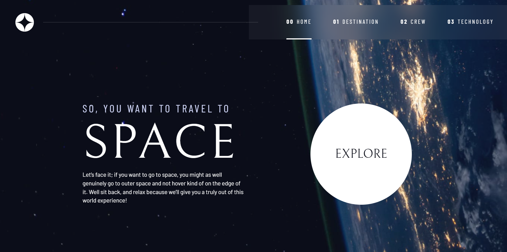
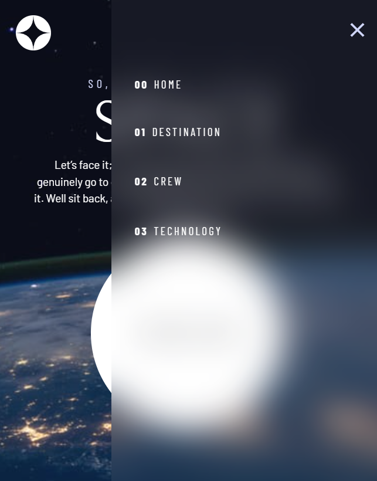

# The-space-travel-website
The sleek mult-page space travel website. This is responsive site featuring a homepage, buttons, a navigation bar, tabs, keyboard navigation and underline, dot and number indicators.

### Preview

> Desktop Previews

> Mobile navigation Previews

### Summury
Brought a Frontend Mentor design to life and created my own design system while building a multi-page space travel website with Kevin Powell as my guide.

### Demo
[Watch demo](https://evgenywas.github.io/The-space-travel-website/)